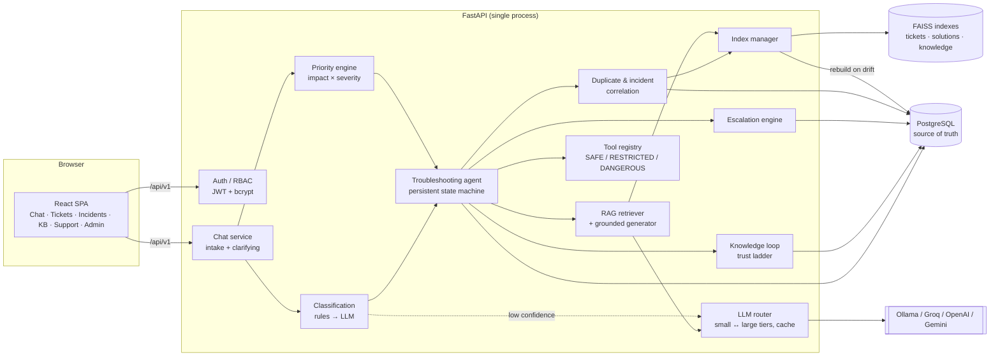

# Precision AI — Architecture

## 1. System overview



Deliberately **one deployable** (API + built SPA) plus PostgreSQL. No microservices: every component is a module with a narrow interface, so any of them can be extracted later.

## 2. Request lifecycle (employee reports an issue)

1. **Intake** (`services/chat.py`) — the message is classified with rules. The bot asks **at most two** questions: a category-specific symptom question (skipped when the intent is already specific) and a scope question (skipped when scope is already stated). Quick replies make both one tap.
2. **Structured ticket** — classification + priority are merged into a `TicketDraft` (pydantic, strict) before any row is written. Ticket numbers are sequential (`INC-000124`, derived from the PK).
3. **Agent run** (`agents/troubleshooting_agent.py`) — a new `AgentRun` walks the state machine until it needs the user (VERIFY) or reaches a terminal state. State and working memory are stored in PostgreSQL, so a run survives restarts.
4. **User confirmation** — "Yes" → RESOLVED + knowledge loop. "No" → RETRY with the next candidate (up to `AGENT_MAX_ATTEMPTS`), then ESCALATE.

## 3. Cost-optimised routing (the core design decision)

| Level | Mechanism | LLM cost |
|---|---|---|
| **L0** deterministic policy | security compromise, shared-infrastructure outage, physical damage, CRITICAL priority → humans immediately | none |
| **L1** rules | keyword + intent regex classification, entity extraction, priority matrix | none |
| **L2** similarity | FAISS: same-user duplicates, cross-user incident correlation, similar history | none |
| **L3** verified retrieval | human/admin-verified solution (or proven user-confirmed one) above threshold, same category → returned directly; documented KB procedure when no LLM is available | none |
| **L4** small model | grounded generation from retrieved KB/solutions (Ollama by default); also classification when rules are unsure | local / cheap |
| **L5** large model | only on retries or low-confidence classification | paid |

Every LLM call is logged (`llm_usage_log`: tokens, cost, latency, cache hit, success); cached responses cost nothing. Each `AgentRun` records its deepest routing level, which the admin dashboard aggregates. With **no model reachable the system still works end-to-end** (L0–L3 + escalation) — this is how the local demo runs.

## 4. Agent state machine

```mermaid
stateDiagram-v2
    [*] --> NEW --> UNDERSTAND --> CLASSIFY --> CHECK_DUPLICATE
    CHECK_DUPLICATE --> DUPLICATE: same user, open, sim ≥ 0.75
    CHECK_DUPLICATE --> LINKED_INCIDENT: ≥3 users, 60 min, sim ≥ 0.55
    CHECK_DUPLICATE --> SEARCH_HISTORY
    SEARCH_HISTORY --> PLAN
    PLAN --> ESCALATE: L0 policy
    PLAN --> TROUBLESHOOT
    TROUBLESHOOT --> ESCALATE: catalogued service DOWN / no candidate
    TROUBLESHOOT --> VERIFY: solution presented
    VERIFY --> RESOLVED: user confirms
    VERIFY --> RETRY: not fixed
    RETRY --> TROUBLESHOOT: next candidate
    RETRY --> ESCALATE: attempts exhausted
    ESCALATE --> ESCALATED
    VERIFY --> LINKED_INCIDENT: incident formed later
```

Transitions are validated (`assert_transition`); an invalid jump raises. Any non-terminal state may move to `CLOSED` when a human takes over. Duplicate/incident checks deliberately run *before* the knowledge search so repeated reports stop early and cost nothing.

**No chain-of-thought is stored or shown.** Users see the 8-step progress checklist and an execution log; IT sees a concise *decision log* (evidence + action, e.g. "Reusing human_verified solution SOL-1 (0.83) without LLM").

## 5. Safety model

| Level | Examples | Who can run it |
|---|---|---|
| SAFE | DNS lookup, TCP/HTTP probe of catalogued services, ping (fixed argv, validated host), disk space, client environment | agent, automatically |
| RESTRICTED | flush DNS, restart VPN client, clear app cache, restart spooler, reset link, unlock account | after the **requester** (or IT) approves |
| DANGEROUS | delete profile, modify production DB, disable security controls, re-image | **admin approval only**; never proposed by the agent |

* There is **no arbitrary-shell tool**; unknown tool names are recorded as `blocked`.
* State-changing actions go through an `ActionConnector`. The shipped connector is a **dry run** (records the approved action) — wire an endpoint-management/identity connector in `tools/executor.py:get_connector()` for production.
* Generated text passes `tools/safety.py` (destructive commands, disabling security software, credential requests); unsafe steps are removed and flagged.
* LLM JSON is always schema-validated (pydantic); categories outside the active set, missing citations for grounded answers, or malformed output are rejected.

## 6. Data model (PostgreSQL)

| Table | Purpose |
|---|---|
| `roles`, `users`, `departments` | RBAC; departments are support teams (escalation targets) or business units |
| `ticket_categories` | extensible categories → owning department, rule keywords (JSONB) |
| `tickets` | core record: classification, user vs system vs effective priority, status, routing, duplicate/incident links |
| `ticket_messages` | chat + ticket thread (`conversation_id` before the ticket exists), structured card `payload` (JSONB) |
| `conversations` | persisted chat state (stage, collected slots) |
| `ticket_events` | audit trail of every change |
| `ticket_assignments`, `ticket_escalations` | assignment history; escalation package (JSONB) |
| `ticket_solutions` | knowledge with trust ladder + usage/success counters |
| `troubleshooting_steps` | visible execution log (agent, user, IT) |
| `ticket_feedback` | user confirmations |
| `knowledge_documents`, `knowledge_chunks` | IT documentation for RAG |
| `agent_runs`, `agent_actions` | agent state/working memory; tool calls with permission + approval state |
| `incidents` | correlated incident groups |
| `llm_usage_log`, `audit_logs`, `attachments` | observability, security audit, uploads |

JSONB is used only for genuinely flexible data (entities, payload cards, agent working memory, escalation packages). Schema changes go through **Alembic** (`backend/migrations`); the initial migration upgrades/downgrades cleanly on PostgreSQL 16 and SQLite.

## 7. Vector search (FAISS)

* Three `IndexIDMap2(IndexFlatIP)` indexes over L2-normalised vectors (exact cosine), keyed by **PostgreSQL ids**: `tickets`, `solutions` (only `user_confirmed`+, active, not rejected), `knowledge` (chunks of active docs).
* Every hit is re-fetched from PostgreSQL and **re-validated** (still active, same category, above threshold) — FAISS is never trusted as the record.
* Persisted to `FAISS_INDEX_DIR` with embedder identity. On startup each index is compared to the DB id set; a missing file, another embedder, or any drift triggers a **rebuild from PostgreSQL**. Admins can also rebuild from the UI.
* `vector_store/base.py` defines the `VectorStore` interface; swapping to pgvector means implementing it (and would remove the single-process constraint below).

### Threshold calibration

Measured with `all-MiniLM-L6-v2` on sample pairs: paraphrases of the same issue score **0.64–0.76**, unrelated issues **0.09–0.22**, related-but-different issues (Outlook crash vs Excel crash) **~0.57**. Because similarity alone cannot separate that last case, every decision is **also gated on category**; near-identical reports (≥ 0.85) may match across categories so a single misclassification cannot hide an outage.

| Setting | Value | Used for |
|---|---|---|
| `DUPLICATE_SIMILARITY_THRESHOLD` | 0.75 | same-user duplicate |
| `INCIDENT_SIMILARITY_THRESHOLD` | 0.55 | cross-user correlation (+ time window + ≥3 users) |
| `SOLUTION_REUSE_THRESHOLD` | 0.62 | L3 reuse of verified solutions (user-confirmed needs +0.08 and a track record) |
| `KB_RELEVANCE_THRESHOLD` | 0.40 | KB chunk context validation |

## 8. Self-improving knowledge loop

`AI_GENERATED → USER_CONFIRMED → HUMAN_VERIFIED → ADMIN_VERIFIED`

* An AI suggestion that the employee confirms becomes a `user_confirmed` solution (retrievable, lower trust).
* IT resolutions and incident resolutions become `human_verified` (admin: `admin_verified`); IT can verify or reject any solution.
* Retrieval score = similarity × (0.75 + 0.25 × trust) + intent match + success-rate adjustment.
* A solution that keeps failing (≥3 failures, <40% success) is withdrawn automatically until reviewed.

## 9. Observability

Structured logs (structlog, JSON in production) with a request id per HTTP call and events such as `ticket_classified`, `llm_call` (provider, tokens, latency, cache hit), `tool_invoked`, `ticket_escalated`, `incident_created`. A redaction processor masks any key that looks like a password/secret/token. Nothing personal beyond ids is logged.

## 10. Known limitations (honest list)

* **Single process.** FAISS indexes live in memory; run one API worker (the container does). Scale out by moving to pgvector.
* **Restricted actions are dry-run** until a real endpoint-management / identity connector is configured.
* **Diagnostics are server-side.** SAFE probes check services from the helpdesk host (per `data/service_catalog.json`), not the employee's device; device-side steps are given to the user.
* **Rules classifier** reaches 87.5% on the small held-out set (see `docs/EVALUATION.md`); misses are routed to the LLM when one is configured, and IT can correct category/priority.
* JWT logout is client-side (tokens expire); add a deny-list for immediate revocation if required.
